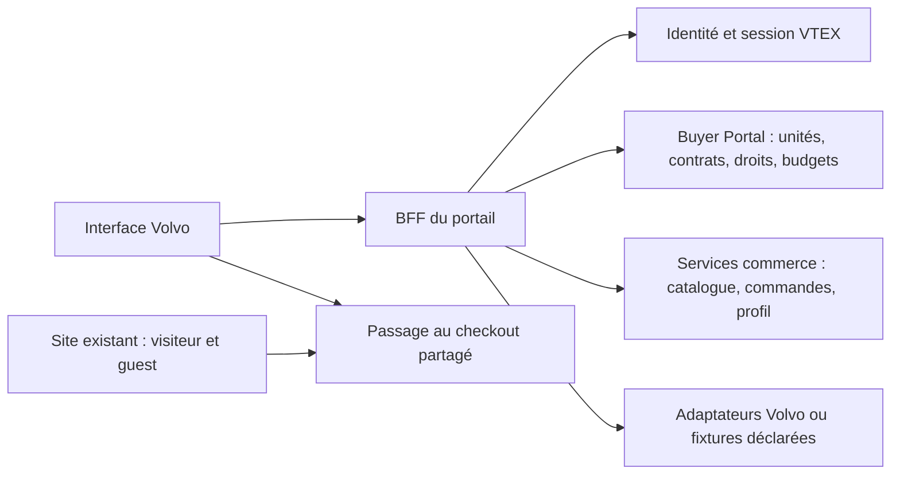

## Ajout de pièces aux listes et publication — 25 septembre

Ajout de Save parts to a replenishment list dans Quick Order et dans le détail d’une commande. Sélection d’une liste active accessible à l’acheteur ; résolution exacte références/SKU et productId catalogue avant toute écriture ; quantités fusionnées puis additionnées à celles existantes (plafond 9999). Les commandes sources sont relues via OMS sous l’identité acheteur. Mutations natives addListItem/updateListItem, puis relecture pour confirmer les quantités. Résultat partiel explicite en cas d’échec ; pas de relance automatique. Le service ne fournit pas ici une transaction multi-lignes : éviter les éditions simultanées de la même liste depuis plusieurs interfaces.

Validation : typecheck/lint/build et six tests listes réussis, couvrant résolution, augmentation, refus de liste étrangère et erreur partielle. Recette des écritures réelles de remplissage encore attendue ; création de liste déjà validée par William. Utilisation : Quick Order ou détail commande → Choose a list → Add parts to list → Review saved list contents → contrôle prix/stock habituel. Une fréquence de liste ne déclenche pas de commande automatique.

William demande la publication de tous les changements sur GitHub et Vercel. Inclus : checkout Promissory et diagnostics, affichage dynamique des autres moyens (non raccordés à la soumission), listes création/remplissage, documentation. Carte et véritable bank transfer restent ouverts. Aucune transaction réelle supplémentaire effectuée par Codex.

## Création de listes — 25 septembre

La liste Oil replenishment for truck 123 & 147 est visible selon la capture William : lecture réelle confirmée. Ajout local d’un bouton Create a list sur /lists et formulaire nom (80 caractères), description (280), fréquence none/weekly/biweekly/monthly. Mutation native createList(input: CreateListInput!) du même provider que FastStore ; identité acheteur serveur, validation stricte et contrôle de session/origine existants. Rafraîchissement de la liste après succès ; doubles clics bloqués et échec ambigu signalé sans relance automatique.

Limite explicite : crée une liste vide. Ajout de pièces, création depuis commandes/draft et édition restent ouverts ; ne pas présenter ces parcours comme réalisés. Aucun changement du contrat ou du budget. Typecheck/lint et trois tests listes réussis. Création réelle non exécutée par Codex ; recette William attendue. Non publié.

## Listes de réapprovisionnement — lecture débloquée, 25 septembre

William confirme que la nouvelle commande apparaît maintenant dans Orders : retirer le point de visibilité en attente pour cette commande.

Comparaison effectuée avec src/features/replenishment-lists/lib/replenishmentApi.ts du FastStore Volvo : même endpoint /_v/private/graphql/v1, même provider vtex.replenishment-service@1.x et getLists/getListItems. Nouvelle lecture réelle depuis /lists local 3001, connecté en wandergarage-buyer : succès, tableau getLists vide. Le blocage GraphQL historique n’est plus reproduit. Aucune modification d’API nécessaire pour ce résultat.

La capture William montre le formulaire Name & Create, avant création ; elle ne prouve pas une liste enregistrée. Nom de liste créée et login FastStore demandés afin de qualifier la visibilité avec la même identité. Ne pas conclure absence de listes dans toute l’organisation à partir du seul résultat de ce buyer. Lecture et préparation depuis une liste déjà codées ; création/édition dans le Customer Portal restent à raccorder, pas déclarées acquises. Prochaine étape : confirmer la liste source et tester son contenu → préparation sous l’identité autorisée, puis tranche de création conservant le service FastStore.

## Paiements et commande confirmée — 25 septembre

William fournit une capture OMS de 1664170500031-01 : 956 USD, Promissory, transaction autorisée, fenêtre d’annulation. Création réelle confirmée par sa capture, sans attribuer ce résultat aux tests automatisés. La liste portail fournie ne contient pas cette référence : visibilité/relecture à qualifier, ne pas déclarer toute la chaîne validée.

Nouvelle demande : afficher les moyens du compte sans filtre Promissory. L’écran liste désormais tous les paymentSystems reçus pour le panier avec les libellés/descriptions VTEX. Les moyens non raccordés sont visibles et signalés, mais non sélectionnables pour éviter de les envoyer comme Promissory. Aucun libellé Bank transfer inventé, aucun identifiant de moyen fixé. La soumission reste limitée à Promissory ; prochaine tranche : qualifier le véritable contrat Bank transfer et brancher le parcours carte (données carte directement vers VTEX), puis recette et visibilité OMS dans Orders. Ce raccordement reste ouvert, pas présenté comme terminé.

## Diagnostic du 25 septembre — échec du clic Place order

Cause retrouvée dans les logs du serveur local 3001 : POST checkout-payment 401, POST checkout-place-order 401, GET checkout-order-status 401. La session locale avait expiré ; la soumission a été refusée avant la création de transaction VTEX. Aucun indice de refus budgétaire sur cette tentative. William ne voyait rien car les erreurs étaient en haut du long écran, hors de la zone du bouton.

Correctifs : erreur affichée près de la confirmation, message de session expirée avec lien Sign in again et soumission désactivée, attente visible et délais bornés pour la soumission/réconciliation. Les futures erreurs de transaction/paiement/processing conservent étape, statut HTTP et code machine VTEX borné, sans réponse brute. Les tentatives incertaines restent verrouillées sans resoumission automatique. Typecheck/lint et 7 tests checkout paiement réussis. Aucun achat envoyé, aucun push.

Suite : se reconnecter, reconstituer/revoir le panier (la session locale précédente n’est pas récupérable automatiquement), puis recette finale William. Si VTEX refuse ensuite pour budget/approbation, examiner le code exact avec le profil courant. Source lecture budgets repérée dans FastStore getBudgets : /_v/store-front/customers/{customerId}/units/{contextId}/budgets ; aucune lecture réelle ni modification de budget effectuée. Ne pas confondre budget et permission PlaceOrders ; ne pas changer de profil pour contourner le refus.

## Recette du 24 septembre — checkout réel avant soumission

Codex a testé dans le navigateur local 3001 : connexion wandergarage-buyer, référence 3095196 → SKU 1437, quantité 1, prix 1 516,39 USD, transfert panier, adresse existante WanderGarage, livraison Standard à 5 USD / 3bd, sélection et sauvegarde Promissory. Total confirmé : 1 521,39 USD. Paiement et livraison persistent après rechargement. La case de confirmation active le bouton Place order ; elle a été décochée ensuite. Aucune transaction/commande réelle n’a été soumise. Le panier de test reste ouvert pour William.

Défaut trouvé et corrigé : React Strict Mode lançait deux lectures concurrentes au montage du checkout, provoquant CART_BUSY. La promesse de lecture complète est maintenant réutilisée lors du rejeu de l’effet ; deux chargements navigateur après correction réussis.

Validation technique : 62 tests automatisés réussis ; le test HTTP jusque-là sauté a été exécuté séparément et réussi sur 3001 (isolation, CSRF, permissions, logout). Son origine est désormais configurable par PORTAL_TEST_ORIGIN, par défaut 3000. Typecheck et lint passent. Reste à valider : transaction réelle, réponse gateway et affichage de confirmation avec une commande effectivement soumise. Promissory est confirmé disponible ; Net 60 n’est pas affiché par la réponse observée. Aucun push.

## Checkout Promissory — 24 septembre 2026

Décision William : terminer le checkout dans le Customer Portal, Promissory seul pour la démo Volvo ; carte bancaire reportée. La capture montre Notes Payable / Net 60 actif, mais ce libellé n’est pas imposé au panier : le portail utilise uniquement les méthodes/conditions effectivement retournées par VTEX, sans présenter Promissory comme un virement déjà effectué.

**Codé localement, recette réelle encore attendue :** sélection et sauvegarde du paiement, récapitulatif adresse/articles/total, confirmation explicite puis transaction → paiement Promissory → gatewayCallback, écran de confirmation dans le shell Volvo et lien Orders. Prix, livraison et autorisation d’achat sont relus avant la soumission. Les cartes et paiements mixtes ne passent pas dans ce parcours. Le checkout livraison conserve sa limite actuelle : adresses déjà disponibles et livraison non planifiée.

Protection contre les doubles achats : réservation par panier persistée dans Redis avant l’appel de transaction (mémoire uniquement en développement), sans expiration automatique. Un timeout/crash/refus après cette réservation bloque toute nouvelle soumission du même panier et montre un état à confirmer, jamais « payé ». Les tentatives incertaines nécessitent vérification dans VTEX ; pas de suppression automatique de leur verrou. Après succès, le prochain transfert prépare un nouveau panier. Aucun identifiant de transaction n’est échangé entre deux requêtes du navigateur : les trois étapes Promissory se déroulent dans une seule requête serveur, sans données carte.

Validation : typecheck, lint et build réussis ; suite existante 60 réussis / 1 scénario HTTP sauté, puis deux tests supplémentaires ciblés réussis (échec paiement et persistance Redis). Six tests de paiement au total. Aucune commande ni paiement réel envoyé, aucune recette navigateur longue. Contrat et disponibilité Promissory du panier Volvo restent à qualifier en réel ; aucune garantie de paiement acquitté. Pas de push/déploiement pour ce lot à ce stade.

Prochaine action William : Quick Order → panier → Checkout → adresse → livraison → Save payment method → vérifier le total → confirmation → Place order. Vérifier la référence et sa présence dans Orders. Si Promissory est absent ou un statut incertain apparaît, transmettre le message/la référence avant toute autre tentative. My Organization reste gelé ; devis/listes gardent leurs dépendances ; l’onglet IA reste au collègue CX.

Sources techniques : https://developers.vtex.com/docs/guides/creating-a-regular-order-from-an-existing-cart et https://developers.vtex.com/docs/guides/orderform-fields.

# Volvo B2B Customer Portal — cadrage avant initialisation

## Priorité courante — démo Volvo (décision William, 21 septembre)

My Organization est suffisant visuellement pour la démo Volvo : conserver les écrans actuels, ne pas poursuivre ce chantier avant la démo. La recette des créations utilisateur/centre de coût et toute validation d’écriture sont reportées après la démo, avant partage aux autres SEs VTEX. Aucun succès d’écriture réel ne doit être annoncé. Restent dans le backlog : modification des rôles, création sous-unités, édition/suppression centres de coût, pagination complète et recette par rôle. Ce report ne retire aucune fonction du périmètre.

Priorités actives :
1. Consolider le parcours de démonstration déjà utilisable : accueil → recherche référence ou flotte/véhicule → préparation Quick Order (saisie/CSV/Excel) → contrôle prix/disponibilité → panier. Corriger seulement les défauts qui gênent la démo, conserver les wireframes et éviter les vérifications navigateur répétées ; courte recette par William.
2. Checkout : obtenir le nom/la portée du flag B2B, puis qualifier adresse/livraison et raccorder paiement/confirmation si débloqué. Ne pas annoncer une finalisation d’achat opérationnelle avant recette.
3. Devis : obtenir la source autorisée équivalente à person.email/profile.email pour l’organisation, puis qualifier accès, création et relecture.
4. Listes : confirmer app/version/workspace et requête GraphQL fonctionnelle avant raccordement ; les appels minimaux restent rejetés.
5. Préparer le script final de démo et le point de sauvegarde local avec distinction données réelles/fixtures/parcours non validés. Pas de push ni déploiement demandé dans cette décision.

Après la démo / préparation au partage SEs : reprendre My Organization et sa recette, puis qualification du déploiement et des autres fonctions restantes selon priorités convenues. La disponibilité des intégrations détermine l’ordre entre checkout, devis et listes ; aucune nouvelle série de sondages identiques sans information nouvelle.

> Mise à jour de phase : William a autorisé le démarrage de la réalisation locale après ce cadrage. Les mentions de phase documentaire ci-dessous sont historiques. Voir [le suivi de réalisation](SUIVI_REALISATION.md) pour l’état implémenté et les limites actuelles.

Date : 18 septembre 2026. Révision après échanges et validation de la mise à jour documentaire par William. Statut : cadrage actif ; aucune implémentation autorisée à ce stade.

## 1. Orientation et frontières

**Objectif : montrer ce que VTEX et du code custom permettent de réaliser pour les use cases Volvo, dans une interface Volvo concrète.** Ni une date d’atelier ni une nouvelle matrice exhaustive des questions Volvo ne constituent un préalable au travail. Les parcours ci-dessous assurent le rattachement aux besoins ; la qualification technique se fait au fil des fonctions, sans bloquer tout le projet sur une capacité encore inconnue.

**Aucune fonction My Account prévue n’est retirée.** Historique/détail/suivi/documents de commande, reordering, quick order/import, listes, devis, organisation/unités/équipe/droits, adresses, paiements, budgets/approbations/comptabilité, profil et déconnexion restent dans la cible. Il ne s’agit pas de limiter le compte à la lecture. La profondeur attendue est celle des fonctions client utiles de My Account, pas toutes les opérations d’administration qu’une API peut exposer. Toute proposition de retrait ou de réduction sera nommée et soumise à William.

Le présent cadrage porte le plan actif ; la [matrice](MATRICE_CAPACITES_VOLVO.md) porte les capacités et les preuves ; le [registre](DECISIONS_PORTAIL_VOLVO.md) conserve les décisions. Les documents de contexte et les visuels sont des références, dont les écarts connus sont résolus ici. Voir [START.md](../START.md) pour l’ordre de lecture.

Construire une application client Volvo indépendante, avec couverture fonctionnelle complète de My Account, adossée au Buyer Portal de `volvoemea`. Les services existants conservent les règles, permissions et données commerce. WanderGarage et ses utilisateurs existants sont la référence de démonstration ; Acme Logistics et Alex Morgan restent des exemples graphiques.

Le site existant conserve la découverte publique et le parcours anonyme/mobile avec guest checkout. Le checkout est une dépendance du programme global : seule son interface avec le portail entre dans ce cadrage, sans reprise du diagnostic. Le portail ne sera pas un dashboard redirigeant systématiquement vers My Account.

Périmètre principal : 1B, 1C, 1D et toutes les opérations de compte. 1F et P2 : extensions bornées, avec source réelle ou démonstration déclarée. 1A appartient au portail fournisseur. Véhicules neufs/occasion : extensibilité future, sans parcours d’acquisition à construire maintenant.

Références locales : [démarrage historique](VOLVO_CUSTOMER_PORTAL_START.md), [scope source](context/Volvo_Customer_Portal_Demo_Feature_Scope.md), [besoins Volvo](context/VOLVO_USE_CASES_AS_REQUESTED.md), [handoff design](../Design/CODEX_HANDOFF.md). Le pack design reste sous `Design/`, sans déplacement des ressources.

## 2. Ce qui a été vérifié et ce qui ne l’a pas été

### Niveaux de preuve

- **D** : capacité documentée officiellement ; cela ne prouve ni activation ni autorisation sur le compte.
- **C** : code présent et inspecté dans le projet de référence ou son plugin local ; cela ne prouve pas un parcours fonctionnel.
- **H** : état historique rapporté dans le démarrage, à relire sur le compte.
- **?** : source, opération ou comportement encore non établi.

Le mode **réel / mock / storyboard** est distinct de l’état **configuré / implémenté / testé techniquement / validé en parcours réel**. Pour le nouveau portail, toutes les lignes sont actuellement **non implémentées**. Aucun test authentifié sur `volvoemea`, aucune mutation VTEX et aucun parcours réel n’ont été exécutés dans cette étude. La couverture exhaustive de l’interface My Account actuellement déployée reste à fermer par inventaire sous les différents rôles.

### Constats établis

| Constat | Preuve et implication |
|---|---|
| Le dossier portail contient contexte et design, sans application initialisée | Inspection locale ; stack, dépôt distant, commandes et hébergement à décider |
| Le site de référence utilise FastStore 4.7.0 et le plugin Buyer Portal 2.0.27 | `package.json` et paquet local inspectés ; ne pas imposer ces versions au nouveau projet |
| Le plugin couvre plus que le menu initial | Pages et services pour unités, contrats, assortiments, utilisateurs, rôles, budgets, politiques d’achat, champs comptables, cartes, moyens de paiement, adresses, profil et order entry |
| Des API publiques Buyer Portal sont documentées | Organization Units, Storefront Roles, contrats, adresses, budgets, politiques d’achat, champs et valeurs par défaut ; références ci-dessous |
| Le guide interne est accessible | Pupulin, version 1.10, mise à jour affichée au 26 août 2026, statut In Review ; guide de configuration, pas relevé du compte |
| Le bulk dispose d’une logique réutilisable | Résolution, doublons, quantités plafonnées et cart handoff présents ; qualification et tests de portage nécessaires |
| L’import lu est CSV | `parseCsv.ts` utilise Papa Parse ; aucun support XLSX déduit de cette présence |
| Les supersessions sont synthétiques | `supersession.ts` le déclare explicitement ; elles ne constituent pas une preuve Volvo de remplacement ou de compatibilité |
| Les listes et devis existants utilisent Master Data | Entités `PL` et `quotes` dans les resolvers ; ne pas les assimiler automatiquement aux services natifs Buyer Portal |
| La lecture des devis n’est pas réutilisable telle quelle | `getQuotes` vérifie une session puis recherche `quotes` avec clé applicative, sans filtre organisation/contrat visible dans le resolver ; risque de portée excessive à traiter avant réutilisation |
| La conversion de devis existante n’établit pas un workflow natif | `useQuote` reçoit articles/prix et applique des prix manuels au panier ; ce n’est pas la preuve d’une acceptation backend d’un devis autorisé |
| Le resolver Vehicles n’est pas une preuve de flotte client | Recherche Master Data `Vehicles` par attributs techniques ; appartenance de véhicules à WanderGarage et source de fitment non établies |

Code inspecté : `/Users/williamjeanne/faststore-volvo/faststore-volvoemea`, HEAD observé `c77bb580c89f9c9a048ffe1f117d1d6c8a8906d2`. L’inspection porte sur les fichiers locaux, sans affirmer que tous sont identiques au commit. Le code et les données du site n’ont pas été modifiés.

### État historique à revalider

Les identifiants, utilisateurs, hiérarchie et montants de référence sont conservés uniquement dans le [document de démarrage, sections 4 à 7](VOLVO_CUSTOMER_PORTAL_START.md). Ils ne sont pas des données courantes vérifiées. Principes à garder :

- WanderGarage et ses utilisateurs existants sont réutilisés, sans repeuplement ni déplacement pour les tests.
- Politique commerciale **1, USA/USD**, conservée.
- Budgets, règles, champs comptables et records `shopper` seront relus au moment de leur intégration. Ne pas réactiver un champ ni corriger des données implicitement.
- Un rôle métier, une unité ou un solde historique ne prouve pas une autorisation effective.

### Contradictions et incertitudes à conserver

Le scope ajusté et les instructions utilisateur prévalent sur le snapshot design : WanderGarage remplace les noms graphiques ; les cinq écrans ne réduisent pas My Account ; Buyer Portal et B2B Suite restent distincts. Les valeurs de tokens sont provisoires et l’accessibilité n’est pas encore validée.

Les valeurs par défaut sont désormais présentes dans la documentation officielle et dans le plugin, alors que des notes anciennes les annonçaient en développement. La disponibilité sur `volvoemea` reste à vérifier. Pour les cartes, le guide interne décrit Gateway pour certaines lectures/suppressions, la documentation décrit Card Token Vault et le plugin possède des clients `saved-cards` : identifier le contrat supporté pour chaque opération avant de coder.

## 3. Matrice des fonctions, écrans, rôles et sources

La [matrice détaillée](MATRICE_CAPACITES_VOLVO.md) donne une ligne par action ou famille d’actions à qualifier séparément. Elle inclut les fonctions du plugin que les cinq écrans de design ne montrent pas. Les opérations non établies restent indiquées comme telles : aucun endpoint n’est inventé pour remplir une case.

Pour clôturer chaque ligne, ajouter : méthode/route ou opération GraphQL exacte, version, authentification, ressource d’autorisation, filtre de portée, erreurs, transition backend, preuve datée et propriétaire. La preuve d’une lecture ne valide jamais une écriture. Chaque création/modification/suppression d’une même famille doit obtenir sa propre preuve.

### Personae et contrôles

| Persona | Usage | Règle de mapping |
|---|---|---|
| Acheteur | Préparer un achat, consulter ses éléments autorisés | `PlaceOrders` ; visibilité d’autres commandes séparée |
| Approbateur | Décider sur les demandes autorisées | `ApproveOrders`, portée et état de demande vérifiés |
| Administrateur d’unité | Gérer les fonctions déléguées | Ressources granulaires ; ne pas lui attribuer automatiquement toute la racine |
| Responsable Procurement | Politiques, budgets, comptabilité | Vérifier chaque ressource ; ne pas supposer le droit d’acheter |
| Fleet/Workshop Manager | Persona métier Volvo | Pas de nouveau rôle VTEX par défaut ; correspondance à définir avec droits réels |
| Concessionnaire assisté | Intervention déléguée | Fonctions et composants mutualisés avec l’acheteur ; sélection de client seulement après preuve des droits délégués |

Les rôles storefront et leurs ressources sont documentés, notamment les distinctions entre achat, approbation, visibilité par contrat/unité, gestion d’adresses et hiérarchie. Les attributions WanderGarage demeurent à relire. [Storefront Roles](https://developers.vtex.com/docs/guides/storefront-roles).

## 4. Proposition d’architecture et d’identité

### Direction technique et première vérification ciblée

**React + TypeScript, application Next.js avec BFF dans le même projet et déploiement indépendant.** Cette proposition convient à une interface opérationnelle très personnalisée et évite un service additionnel sans nécessité. **Vercel est l’hébergement proposé**, sans déploiement ni domaine configuré. Versions maintenues et gestionnaire de paquets seront choisis à l’initialisation, après autorisation de coder. Aucune commande d’installation n’est encore applicable.

Le plugin Buyer Portal 2.0.27 sert de référence d’implémentation pour les adaptateurs ; il n’est pas retenu comme dépendance d’exécution du portail. Sa couche clients/services est largement séparée de l’UI, mais son portage exige validation de la session, des permissions, des erreurs et du cache. Porter d’abord un chemin utile, pas les quinze domaines en bloc.

FastStore reste une solution de repli uniquement si une difficulté concrète démontre que des capacités essentielles du Buyer Portal ou son login ne sont supportées que dans son environnement. La liberté visuelle seule ne justifie pas de perdre un chemin d’intégration supporté. Une application VTEX IO supplémentaire ne sera envisagée que pour une lacune précise des services natifs, documentée.

- UI : navigation, formulaires, tables, accessibilité, états d’erreur et rendu Volvo. Les règles VTEX restent dans les services VTEX ; tout workflow custom appartient à son backend, jamais au seul état de l’interface.
- BFF : session, validation des entrées, contrôle de portée, appels serveurs et adaptation des réponses. L’identité et les objets autorisés viennent des services, jamais d’un `organizationId` accepté sans vérification.
- Adaptateurs par domaine : compte, organisation, achats, devis/listes, flotte/support. Les fixtures utilisent les mêmes interfaces mais un mode explicite ; aucun basculement silencieux en mock après erreur.
- Référentiels : VTEX pour le commerce ; Volvo/système métier désigné pour flotte, fitment, Parts Assure et réclamations. Ne pas dupliquer un référentiel existant de devis, permissions ou soldes. Une capacité custom sans service existant peut avoir une persistance dédiée et un propriétaire explicite, définis lors de son intégration.
- Les informations personnalisées passent par le BFF et ne sont pas mises en cache partagé. Une recherche strictement publique peut appeler directement l’API publique ; assortiments/prix privés exigent le contexte autorisé.
- Pas de nouvel usage générique de Master Data pour combler une lacune. Les entités natives sont consommées selon leurs contrats d’intégration, sans écrire directement pour contourner une règle métier.

### Identité : proposition et conditions de faisabilité

1. **Démo : conserver les identités VTEX existantes**, notamment le login par identifiant si confirmé. Ne pas créer une seconde base utilisateur. Réutiliser le parcours de login hébergé seulement après validation du retour autorisé et du mécanisme de session du nouveau domaine.
2. **Cible Volvo : fédération avec l’IdP choisi par Volvo**, sans supposer qu’un IdP ou un mapping existe déjà. Le flux OAuth headless documenté prévoit un échange vers un jeton utilisateur VTEX et reste soumis à disponibilité sur le compte. [Authentification headless](https://developers.vtex.com/docs/guides/headless-authentication).
3. Session portail opaque, cookie `HttpOnly` et `Secure`, configuration SameSite adaptée au flux retenu. Jetons sensibles et secrets côté serveur. Protection CSRF des mutations et validation des URLs de retour.
4. Relever les attributs réels `Domain`, `Path`, expiration et renouvellement. Le fait d’utiliser le même compte ou deux sous-domaines ne partage pas automatiquement les cookies ; un CNAME ne modifie pas leur portée. Aucun transfert de jeton dans l’URL, aucun cookie VTEX supposé lisible depuis un autre domaine.
5. Après authentification : résoudre utilisateur → unité → scopes/contrats → permissions effectives ; charger uniquement le contexte autorisé. Ne pas confondre `userId`, contrat commercial et fiche `shopper`.
6. Navigation et actions reflètent les droits ; le BFF et les services les contrôlent à chaque opération. Une clé applicative reste une identité machine : elle ne remplace pas l’autorisation de l’acheteur.
7. Changement de contexte : valider le droit de sélection, renouveler le contexte serveur si nécessaire, invalider les données précédentes, puis revalider panier, prix, adresses et devis. Ne pas déplacer l’utilisateur pour simuler ce changement.
8. Expiration/révocation : fermer l’accès et demander une réauthentification ; conserver seulement le brouillon non sensible utile. La déconnexion doit traiter la session locale et le mécanisme VTEX retenu. Définir séparément une éventuelle déconnexion globale de l’IdP.

**Première vérification technique, lors de la phase de réalisation autorisée :** login/session → lecture Buyer Portal → unité/contrat et permissions d’un acheteur. Elle confirme le premier accès connecté sans attendre l’inventaire de toutes les API. Le passage au checkout et le retour portail sont vérifiés ensuite dans la tranche d’achat ; ils ne bloquent pas les fonctions de compte indépendantes. Aucun diagnostic du checkout global n’est repris.

Le mode concessionnaire réutilise recherche, préparation d’achat, devis et commandes. `isRepresentative` est un indice observé dans le plugin, pas une preuve suffisante de délégation : les services doivent confirmer les clients accessibles et les actions autorisées. Un scénario assisté peut être illustré avec un contexte fictif déclaré en attendant cette preuve, sans exposer de données d’un client réel.

### Devis et extensions custom

Les devis restent une fonction à réaliser. Rechercher d’abord le service existant et réutiliser ses règles. S’il manque, proposer une extension backend ciblée avec persistance, contrôle d’accès, états/transitions et prix décidés côté serveur. **L’absence d’API native n’impose ni abandon ni storyboard.** Toute nouvelle persistance doit combler une lacune identifiée, sans créer un second référentiel concurrent. Le resolver actuel et ses prix reçus du client ne sont pas repris tels quels.

Pour les domaines Volvo, une fixture de flotte/fitment peut être reliée à de vrais SKU, offres et achats VTEX. Le caractère simulé de la compatibilité reste visible. Booking, claims ou services externes peuvent être intégrés, implémentés dans un backend custom approprié ou illustrés ; une simulation n’annonce jamais une opération externe réelle.

### Interfaces à définir

- `BuyerContext` : utilisateur, racine, unité autorisée, contrat, permissions et contexte commercial provenant du serveur ; contexte véhicule facultatif et tâche courante séparés.
- `Capability` : actions disponibles, mode réel/mock/storyboard et raison d’indisponibilité ; le front ne reconstruit pas une permission à partir du nom du rôle.
- `OperationResult` : résultat confirmé, référence persistante si fournie, erreur explicite et identifiant de corrélation. Un timeout de mutation n’est pas un succès et ne déclenche pas une répétition aveugle.
- `CheckoutHandoff` : identifiant de panier autorisé, contexte contractuel, lignes/quantités/sellers et références comptables acceptées ; URL de retour sur liste autorisée. Le système partagé reste propriétaire de la commande et du paiement.
- Association Volvo : références véhicule/ordre de travail au niveau approprié, y compris par ligne ; support de persistance à établir avant de promettre les filtres historiques VIN/WO.

Ces noms sont des frontières proposées du portail, pas des API VTEX existantes.

## 5. Navigation et parcours

Barre permanente : **WanderGarage → unité/site autorisé → contrat si choix permis → véhicule facultatif → tâche/urgence**. Une unité, une adresse, un quai de livraison et un centre de coût sont des concepts distincts. Le véhicule ne devient pas une condition d’accès aux achats de stock.

La navigation canonique compte 14 entrées : **Home, Fleet & Vehicles, Find Parts, Quick / Bulk Order, Lists, Quotes, Orders, Approvals, Returns & Claims, Contracts & Services, My Organization, Payment Methods, Support / Dealer, My Profile**. Déconnexion dans le menu profil. Les cinq groupes du tableau suivant servent seulement à organiser la spécification ; ils ne sont pas cinq menus supplémentaires. La visibilité dépend des droits. Les libellés/routes de ce tableau priment sur les variations des images.

| Groupe | Entrées et routes |
|---|---|
| Travail quotidien | Accueil `/home`, Flotte `/fleet`, Trouver une pièce `/parts`, Commande rapide `/quick-order` |
| Achats | Listes `/lists`, Devis `/quotes`, Commandes `/orders`, Approbations `/approvals` selon droits |
| Suivi Volvo | Retours et réclamations `/claims`, Contrats et services `/services` avec mode de démonstration affiché |
| Organisation | `/organization` : structure, équipe, droits, adresses/destinataires, contrats commerciaux/assortiments, budgets, règles, comptabilité et valeurs par défaut |
| Personnel | Moyens de paiement `/payments`, Profil `/profile`, Support/concessionnaire `/support`, déconnexion |

Les détails utilisent des identifiants opaques, toujours autorisés côté serveur. Documents et notifications sont contextuels dans les fiches et l’accueil ; pas de menu vide ajouté artificiellement. Les contrats d’achat restent dans Organisation, les couvertures de maintenance et abonnements dans Services.

| Parcours | Étapes | Résultat et preuve attendue |
|---|---|---|
| Réapprovisionner, 1C | Connexion acheteur → unité → saisie/collage/CSV → exceptions → panier → comptabilité → checkout partagé → commande | Quantités/sellers conservés, budget appliqué, aucune obligation de véhicule ; XLSX ajouté séparément |
| Achat urgent, 1B | Véhicule/WO/urgence → pièce/options → disponibilité et délai → achat ou spécialiste | Aucun engagement VOR, sourcing ou backorder inventé ; contexte conservé |
| Trouver la bonne pièce, 1D | Référence/VIN/commande précédente → résultats → compatibilité/éligibilité → panier ou concessionnaire | Provenance de fitment visible ; si inconnue, ne pas afficher « compatible » |
| Approbation | Acheteur soumet → règle backend → file autorisée → décision → état relu | Budget et approbation évalués séparément ; aucun seuil calculé par le portail |
| Devis | Liste → détail → action autorisée → état relu → conversion si service supporté | Transitions et prix proviennent du service, aucune approbation locale fictive |
| Administration | Admin → unité → équipe/adresse/règle/budget → sauvegarde autorisée → relecture | Persistance et restrictions constatées avec acheteur distinct |
| Parts Assure, 1F | Véhicule → couverture → pièces couvertes/non couvertes → commande → claim → service record | Contrat, décision de couverture, délai et référence claim issus du système désigné ou explicitement simulés |
| Besoin connecté, P2 | Alerte → solution pièces/service → achat/réservation/activation | Intégration/custom si destination disponible, sinon illustration déclarée ; aucune consigne de sécurité inférée |
| Handover | Besoin → synthèse du contexte autorisé → destinataire métier → référence/accusé de réception | Sans destination réelle, montrer une simulation, pas « demande envoyée » |

L’arrivée depuis le site public transmet seulement un contexte utile et autorisé ; authentification et conditions B2B sont revalidées. Le parcours guest lui-même reste dans le projet site.

## 6. Plan de réalisation par fonctions utilisables

**Ordre opérationnel pendant l’attente du flag checkout signalée par William :** Codex corrige la continuité de navigation (codée, recette visuelle attendue), puis qualifie et raccorde les devis. L’autre codeur prend l’import XLSX, périmètre réservé dans COORDINATION.md. Le nom et la portée du flag B2B restent à confirmer ; le checkout n’est pas déclaré opérationnel. Cette répartition remplace temporairement l’ordre checkout puis devis ci-dessous.

**Priorité actualisée le 20 septembre, autorisée par William : checkout dans le portail puis création de devis depuis le panier.** Remplace l’ancienne cible de redirection vers le checkout du site. Préserver les wireframes et la session acheteur serveur.

| Sous-lot Codex | Livraison et critère de sortie |
|---|---|
| Checkout A — panier et livraison | Codé le 20 septembre, recette réelle William attendue. Écran portail : panier relu, adresse acheteur autorisée, options/délais/frais retournés par VTEX, recalcul et gestion des refus. Aucun prix/délai inventé. |
| Checkout B — paiement et confirmation | Moyens réellement disponibles du compte, récapitulatif, autorisations et politiques VTEX, soumission explicite puis confirmation/commande. Qualifier d’abord les moyens B2B du compte ; aucune donnée carte brute dans le BFF. Recette William sans transaction réelle automatique. |
| Devis A — créer et relire | Nom/note et lignes du panier avec prix, identité et organisation établis côté serveur. Écriture dans le référentiel quotes existant avec autorisation qualifiée ; retour d’un identifiant et relecture du même devis. Aucun fallback silencieux en stockage local. |
| Devis B — détail et actions | Détail, transitions autorisées et conversion selon les capacités du service, après validation de la création/relecture. |

Les refus d’accès au référentiel devis ou l’indisponibilité d’un moyen de paiement doivent être documentés comme dépendances précises ; ne pas les contourner avec une clé applicative non qualifiée ou une simulation présentée comme réelle.

**Réalisation locale autorisée et commencée.** Les tranches ci-dessous conservent le périmètre complet. L’ordre opérationnel et la méthode ci-après, actualisés le 20 septembre 2026 avec William, remplacent les anciennes indications de phase documentaire.

| Tranche | Livraison | Critère de sortie | Dépendances limitées à cette tranche |
|---|---|---|---|
| 1 — Premier accès et espace Volvo | Vérification ciblée session/unité/droits, puis shell responsive, login/logout, contexte, profil et accueil | Données réelles autorisées sous identité acheteur ; états vide/erreur/refus | Session accessible et mécanisme d’authentification qualifié ; pas d’inventaire global préalable |
| 2 — Commandes et réapprovisionnement | Historique/détail/suivi/documents, reorder, quick order, collage/CSV, listes, panier et checkout intégré | Parcours utilisable de commande précédente ou liste vers nouvel achat ; quantités et références conservées | Services Checkout VTEX pour la finalisation dans le portail ; les lectures avancent indépendamment |
| 3 — Gestion du compte | Organisation/unités/équipe/droits, adresses/destinataires, contrats/assortiments, paiements, budgets/règles/approbations et comptabilité | Opérations My Account utiles persistantes et conformes aux droits, testées par rôle | API et autorisations qualifiées au fil de chaque fonction ; changements partagés coordonnés |
| 4 — Devis | Liste/détail, création et actions métier, conversion en achat | Devis persistant, états/prix autorisés côté serveur ; service existant ou extension custom qualifiée | Identifier le service ou définir l’extension ; aucun remplacement silencieux par storyboard |
| 5 — Parcours Volvo et assistance | Flotte/véhicule → pièce → achat ou handover ; VIN/WO ; composants communs acheteur/concessionnaire ; import XLSX | Jeu explicite véhicule → SKU réel → offre → résultat attendu ; mode de chaque donnée visible ; véhicule facultatif | Sources réelles ou fixtures bornées ; délégation réelle vérifiée seulement pour l’accès aux clients réels |
| 6 — Extensions Volvo | Retours, garantie/consigne, Parts Assure, service records, alertes et solution P2 | Parcours intégré/custom ou illustration déclarée, sans fausse soumission externe | Qualifier source/destination par fonction, sans attendre toutes les intégrations Volvo |

La séquence indique des priorités, pas des barrières entre tous les domaines. Les fonctions indépendantes continuent en cas de blocage local. CSV précède XLSX par réutilisation ; **XLSX reste dans la cible**, sans nouvel arbitrage de périmètre. Les cinq écrans dessinés sont des références visuelles et non une définition réduite de la livraison.

Le chantier global storefront/offres fournit les offres et sellers utilisables ; le portail les consomme et montre le suivi correspondant. Vérifier les sellers déjà rapportés avant toute création. Plusieurs expéditions ne prouvent pas plusieurs vendeurs. Cette dépendance ne transfère ni l’administration marketplace ni le diagnostic checkout au portail.

Le suivi opérationnel à jour et la réservation des fichiers sont dans [COORDINATION.md](COORDINATION.md). Ajout atomique/version du brouillon codés et testés par Codex ; lot 3 recherche/flotte terminé et relu, recette William attendue. Priorités désormais checkout intégré et création/relecture devis.

### Intégration des lots flotte / Find Parts — 20 septembre

Les lots de Claude avancent les tranches 2 et 5 et le cas 1D : flotte de 16 fixtures, fiche véhicule, recherche catalogue, VIN de démonstration, facettes et ajout au brouillon sont codés. Intégration **avec réserves**, revue dans [REVUE-FLOTTE-PARTS.md](REVUE-FLOTTE-PARTS.md). Recherche catalogue réelle publique ; prix contractuels, fitment réel et recette connectée de bout en bout ne sont pas acquis.

Priorité immédiate : corriger les ajouts concurrents/quantités du brouillon (Codex), et facettes VIN/pagination/offres publiques/recherche exacte (lot proposé à Claude dans [LOT-CLAUDE-SUIVANT.md](LOT-CLAUDE-SUIVANT.md)). Périmètres de fichiers séparés ; les fichiers partagés API/session/section restent à Codex. Recette manuelle William ensuite, sans répétition navigateur agent.

En parallèle, le handoff checkout et la lecture des devis personnalisés sont codés par Codex mais restent à qualifier en réel. La lecture devis utilise désormais Master Data quotes sous session acheteur et filtre organisation ; un refus API éventuel ne vaut pas absence de devis. Le passage checkout reprend le mécanisme local FastStore par orderFormId, sans transférer de cookie d’authentification.

Aucun retrait du périmètre Volvo : WO, fiche produit, restrictions, supersessions, sourcing/délais, fitment, commande précédente et XLSX restent au backlog. Les « hors périmètre » du handoff désignent uniquement les limites de ces deux lots.

### Ordre opérationnel actualisé après revue du code

| Étape | Résultat concret attendu avant de poursuivre |
|---|---|
| 0 — Confirmer les sources du prochain lot | Une correspondance courte écran existant → appel → service/données → contrôle de portée → preuve disponible. Distinguer listes PL, listes de réapprovisionnement GraphQL et routes poc-harness ; devis personnalisés Master Data et API native quoting. Identifier le mécanisme de permissions du Buyer Portal réellement utilisé, sans supposer la B2B Suite installée. |
| 1 — Terminer préparation/panier | Contrôle d’autorisation qualifié, SKU disponible, ajout mesuré, consultation/handoff du même panier. Réutiliser les fonctions déjà présentes ; qualifier le chemin des listes avant de développer davantage leur adaptateur. William effectue la recette manuelle. |
| 2 — Commandes et devis | Commande réelle accessible pour qualifier détail/documents/reorder ; source des devis confirmée, portée organisation/contrat et unités monétaires explicites, puis portage du parcours complet. Un resolver existant sans contrôle de portée n’est pas repris tel quel. |
| 3 — Compte entreprise | Porter organisation/équipe/adresses/contrats puis budgets/approbations/paiements, selon les services et droits réellement disponibles. Qualifier les dépendances par fonction, sans audit global préalable. |
| 4 — Volvo et extensions | Flotte/VIN/WO, véhicule/pièces, concessionnaire et XLSX ; puis retours, garanties, Parts Assure, services et P2. Périmètre des tranches initiales conservé. |
| 5 — Publication | Choisir d’abord le flux d’authentification de production, puis adapter stockage des sessions, domaines/origines et cookies ; préparer GitHub et Vercel. Ne pas présumer qu’un changement de variable suffit ni imposer un flux VTEX ID non qualifié. |

Le point initial Git d0fb2d3 existe. Un nouveau snapshot commun des travaux parallèles doit être établi après cette revue, sans assimiler sauvegarde et validation fonctionnelle. Le push et le déploiement restent distincts. Lisibilité/formatage, configuration des domaines et compteur de connexion sont traités avec les modules concernés, sans lancer une refonte générale.

### Méthode de travail et maîtrise des tokens

- Partir de CLAUDE.md et ne lire que les fichiers utiles au lot ; ne pas refaire l’analyse globale à chaque reprise.
- Avant un nouvel adaptateur, confirmer la source utilisée par le parcours visé. Le code local prouve une implémentation, pas son déploiement ; un HTTP 200 vide ne prouve pas que le bon référentiel est interrogé.
- Réutiliser le contrat et la logique existants après examen de leur portée. Ne pas copier une lecture applicative non filtrée ni créer un troisième référentiel.
- Livrer par parcours complet, avec un bref bilan : utilisable, codé mais non validé, bloqué. Ne pas annoncer une intégration terminée sur la seule base de mocks.
- Regrouper TypeScript, lint et tests pertinents à la fin du lot ; build lorsqu’utile à la livraison. Refaire un contrôle seulement si une modification ou un échec le justifie. Conserver les tests automatisés de portée, session et mutations sensibles.
- **Recette navigateur par William par défaut** : fournir 3 à 5 manipulations, données nécessaires et résultat attendu. Demander le résultat observé et l’erreur éventuelle ; ne pas refaire ensuite un parcours déjà validé par lui. Intervention navigateur de l’agent seulement pour un diagnostic précis ou à sa demande.
- Si une source bloque, mener une investigation ciblée. Si elle ne tranche pas, consigner la preuve et demander uniquement l’information manquante ; avancer sur une fonction indépendante. Pas de séries d’essais sur des endpoints supposés.
- Tenir CLAUDE.md synthétique et actuel. Historiser seulement les décisions et preuves utiles dans le suivi ; éviter les sections contradictoires ajoutées à chaque reprise.

### Qualification de la livraison actuelle

- Quick Order : résolution et simulation réelles constatées ; transfert codé/testé sur réponses simulées, bloqué par les droits ; handoff non livré.
- Commandes : historique acheteur vide observé ; détail, documents et renouvellement **non validés sur commande réelle**.
- Devis : réponse vide de l’API quoting observée ; **source du parcours attendu non confirmée**, alors que le parcours personnalisé existant utilise Master Data quotes. Ne pas annoncer « devis intégrés ».
- Listes : lecture GraphQL en erreur ; présence de plusieurs implémentations locales à distinguer, sans conclure à un simple refus de droits ni à l’absence certaine du service.

### Corrections design à intégrer pendant la réalisation

- Conserver la structure visuelle Volvo ; utiliser WanderGarage et ses utilisateurs pour les données intégrées. Acme/Alex restent dans les images de référence uniquement.
- Appliquer la navigation canonique ci-dessus. Maintenir le responsive et les contrôles clavier ; pas de nouvelle décision desktop-only.
- Ne pas reprendre la phrase de sécurité de l’accueil comme information réelle sans source Volvo. Si donnée illustrative, la présenter explicitement comme telle.
- Recalculer les montants des fixtures de devis depuis les lignes, remises, fret et taxes ; les chiffres contradictoires de l’image ne sont pas la référence de calcul.
- Relier main-d’œuvre, couverture service, approbation de devis et création de work order à des comportements identifiés, existants ou custom ; sinon signaler leur simulation. Ce sont des détails à qualifier pendant la tranche devis/Volvo, pas des fonctions supprimées.
- Préparer le mapping véhicule de démonstration → références/SKU réels → sellers/offres utilisables → résultat attendu, incluant compatible/incompatible/inconnu selon la source. Le SKU réel ne rend pas un fitment fictif réel.

### Validation prévue lors de la réalisation

- Permissions : acheteur seul, administrateur, approbateur, Procurement sans achat ; refus de lecture/modification hors unité/contrat et d’élévation de droits, y compris via API directe.
- Identité : expiration, retour de login, URL profonde, déconnexion, refus du contexte arbitraire, changement autorisé sans fuite de cache.
- Bulk : 150 lignes, références inconnues, doublons, quantités invalides/plafonds, cycles et limites de supersession, offres/sellers, différence CSV/XLSX ; fixtures identifiées.
- Commerce : nouvelle disponibilité/prix au handoff, données comptables à la ligne et à la commande, commande partielle, devis expiré/action devenue invalide, répétition de clic et timeout sans duplication.
- Budgets/approbations : cas séparés avec soldes courants. Les exemples historiques Chicago ~1 500 USD et Dallas ~200 USD ne sont pas des résultats garantis.
- Paiements : méthodes personnelles/contractuelles autorisées, rendu masqué et mécanisme hébergé/tokenisé ; pas de données carte dans le BFF ou les logs.
- UI : desktop/tablette/mobile, clavier, focus, labels, contraste AA, statuts non portés uniquement par la couleur, chargement/vide/erreur/accès refusé.
- Exploitation : erreurs corrélées et expurgées, suivi des échecs de login/API/handoff, mode de chaque donnée, retour arrière indépendant du site. Aucun nouvel outil de mesure massif repris par défaut.

Tests d’écriture et commandes réelles seront effectués dans une phase ultérieure avec périmètre et données de test convenus ; ils ne sont pas inclus dans cette phase de documentation sans modification VTEX.

## 7. Décisions et remontées utiles

Le [registre de décisions](DECISIONS_PORTAIL_VOLVO.md) distingue instructions confirmées, direction proposée et vérifications techniques restantes. Il remplace la liste d’arbitrages préalables exhaustive.

- Direction de travail : Next.js/React/TypeScript avec BFF ; Vercel proposé ; pas de déploiement autorisé actuellement.
- Démo : comptes WanderGarage existants, USA/USD ; anglais comme langue de travail proposée d’après les références, sans migration linguistique ou monétaire.
- My Account : fonctionnalités conservées ; APIs et actions secondaires qualifiées à mesure de l’intégration. Pas de limitation implicite à la lecture.
- Custom : autorisé comme approche de conception pour répondre aux use cases ; réaliser l’extension seulement dans une phase de code autorisée. L’absence de natif est un problème à résoudre, pas une suppression automatique.
- Questions à William : uniquement retrait/réduction nommé, changement de périmètre ou blocage concret nécessitant une décision. Les choix courants et corrections visuelles sont traités par l’implémentation.
- Date d’atelier, matrice exhaustive des questions et attribution de tous les systèmes Volvo ne sont pas des conditions de démarrage. Les frontières avec les autres projets restent explicites.

La prochaine autorisation nécessaire est celle de **commencer la réalisation**. La mise à jour documentaire ne vaut ni autorisation de coder, ni de changer les comptes, le DNS ou le routage partagé.

## 8. Sources et règles de travail

Skills appliqués : `william-development-rules`, `architecture-well-architected-commerce`, `headless-bff-architecture` ; `google-drive` pour lire le guide interne. Aucun skill checkout de diagnostic appliqué. Les skills FastStore ou VTEX IO seront chargés seulement si la stack/extension correspondante est retenue.

Références officielles consultées le 18 septembre 2026 :

- [Organization Units API](https://developers.vtex.com/docs/api-reference/organization-units-api) : unités, utilisateurs rattachés et scopes.
- [Storefront Roles](https://developers.vtex.com/docs/guides/storefront-roles) et [API](https://developers.vtex.com/docs/api-reference/storefront-roles-api) : droits et rôles, activation requise sur le compte.
- [Buyer Portal integration overview](https://developers.vtex.com/docs/guides/b2b-buyer-portal-integration-overview) : domaines d’intégration ; disponibilité documentaire distincte de l’installation.
- [Master Data architecture](https://developers.vtex.com/docs/guides/b2b-buyer-portal-master-data-architecture) : contrats `CL`, adresses `AD`, `shopper`, champs, destinataires et valeurs par défaut ; unités/utilisateurs distincts de Master Data.
- [Budgets API](https://developers.vtex.com/docs/api-reference/budgets-api), [Buying Policies API](https://developers.vtex.com/docs/api-reference/buying-policies-api), [Custom Fields API](https://developers.vtex.com/docs/api-reference/custom-fields-api).
- [Card Token Vault API](https://developers.vtex.com/docs/api-reference/card-token-vault-api) : à réconcilier avec les opérations cartes du plugin installé.
- [Headless authentication](https://developers.vtex.com/docs/guides/headless-authentication), [Profile and order history](https://developers.vtex.com/docs/guides/headless-profile-management-and-order-history).
- [Guide interne Pupulin v1.10](https://docs.google.com/document/d/11YFQFrgSkGGDWb0cwA4XlFAifFYE6yc_q9w8Y3aCxVw/edit) : lu via Drive, usage interne ; aucune instruction de configuration exécutée.

Limites : pas d’audit de sécurité complet de l’ancien site, pas d’inventaire live des flags/apps, pas de vérification des licences du starter upstream ni de test de compatibilité headless indépendant. Ces points sont explicitement prévus avant réutilisation ou engagement d’intégration.

### Clôture de revue du lot 3 Claude

Corrections 3–6 relues dans les fonctions withVehicleModel, clampPartsPage/reachablePages, exactReferenceMatch et les deux écrans. Textes catalogue du PartsPicker et ajout atomique Codex coexistent. Lot intégré au plan comme **codé/testé, recette navigateur connectée en attente**. Les mesures de limite moteur et de comptes de résultats restent les preuves rapportées par Claude, non re-sondées par Codex. Premier SKU, vendeur non transmis et fitment illustratif restent au backlog ; aucune réduction de périmètre.

### Dépendance devis constatée

Qualification réelle WanderGarage : identité valide, mais profile.email absent (session créée puis mise à jour). La création/relecture attend la source vérifiable d’organizationId équivalente au person.email du site. Aucun refus Master Data constaté : appel non effectué faute de périmètre. Détails et demande technique dans SOURCES_PARCOURS.md ; import XLSX continue indépendamment.

### 21 septembre — listes qualifiées, raccordement en attente

Trois sondages réels : requête complète et minimale sur le site, minimale sur domaine VTEX ; tous HTTP 400 GraphQL validation failed. Contrat local conforme au code source du site mais rejeté par le service actif. Installation/version/workspace restent à confirmer, sans affirmer une app absente. Diagnostic spécifique ajouté, tests ciblés ; aucune écriture ni liste simulée. Message équipe VTEX dans SOURCES_PARCOURS.md. Devis et checkout conservent leurs dépendances séparées ; import Excel validé par William.

### Organisation — première tranche du 21 septembre

Écran sous-unités/équipe raccordé en lecture à l’unité de session ; première page utilisateurs explicitement indiquée. Recette réelle buyer : 403 sur les lectures administratives. Attente d’un compte autorisé pour qualifier lecture positive puis création unités/utilisateurs. Centres de coût à raccorder aux champs comptables du contrat, pas aux unités. Gestion complète toujours au périmètre ; aucune mutation implémentée dans cette tranche.

## 21 septembre — centres de coût et création utilisateurs

Recette William via capture : trois sous-unités et deux utilisateurs visibles avec son compte autorisé. Lecture organisation validée pour ce compte ; ne pas généraliser le refus constaté avec buyer.

Nouveau lot codé : liste première page des valeurs cost-centers sous le contrat/unité courants ; création d’une valeur (code/description) ; rôles disponibles via roles/ids et formulaire de création utilisateur v3 (login, nom, email, rôle). Sources : AccountingValuesClient, RolesClient, UsersClient du plugin Buyer Portal 2.0.27. Contrat et unité dérivés serveur, corps stricts, rôle recontrôlé, session revalidée à chaque mutation ; VTEX reste autorité d’écriture. Aucune clé admin ni token de création envoyé au navigateur. Pas de relance automatique ; formulaire bloqué après succès ou résultat incertain, actualisation de la liste après succès.

Validation : TypeScript et deux tests organisation réussis (scope, rôle invalide, refus, absence de fuite token). Pas de création distante par Codex. Recette William : ouvrir My Organization avec le compte autorisé, vérifier centres/rôles, puis créer explicitement un centre et un utilisateur de démonstration si souhaité et vérifier leur présence après actualisation. Une erreur de lecture après succès ne doit pas conduire à soumettre une seconde création.

Restent ouverts : modification des rôles des utilisateurs existants, édition/suppression centres, pagination au-delà première page, création unités. Les formulaires de création sont codés, pas encore validés contre VTEX en écriture. Import XLSX inchangé.
